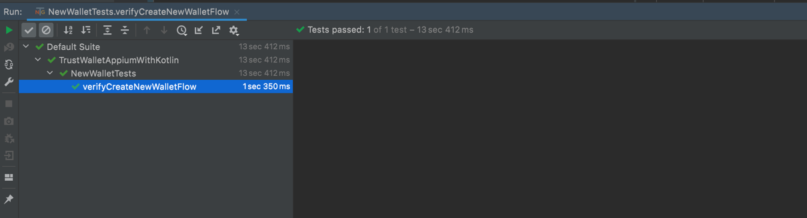

### Application FLow:

Welcome screen -> Guest user home screen -> I don’t have a wallet -> Set Passcode
screen -> Confirm Passcode screen -> Deny biometric login pop up -> Secret phrase
backup(choose backup manually) -> Consent screen -> Recovery phrase -> Confirm
recovery screen -> Stories screen -> Wallet home screen.

### Test Plan :

### Objective:
To test the flow from the welcome screen to successfully opening the wallet with new user tips displayed on the home screen

Certainly, here's the table with the test cases in the format you provided:

| **Test Case ID** | **Test Case Description** | **Preconditions** | **Test Steps** | **Expected Result** | **Status** |
|------------------|--------------------------|------------------|----------------|---------------------|------------|
| TC001            | Positive: Create New Wallet | - | 1. On Welcome screen, select "I don’t have a wallet" 2. On Set Passcode screen, set a valid passcode 3. On Confirm Passcode screen, confirm the passcode 4. On Secret phrase backup screen, successfully back up secret phrase 5. On Consent screen, agree to terms 6. On Recovery phrase screen, confirm recovery phrase 7. On Confirm recovery screen, confirm recovery process 8. On Stories screen, proceed 9. On Wallet home screen, verify elements | New wallet is created and all screens are successfully navigated. | partially executed |
| TC002            | Negative: Cancel Recovery Confirmation | - | 1. On Welcome screen, select "I don’t have a wallet" 2. On Set Passcode screen, set a valid passcode 3. On Confirm Passcode screen, confirm the passcode 4. On Secret phrase backup screen, successfully back up secret phrase 5. On Consent screen, agree to terms 6. On Recovery phrase screen, cancel recovery phrase confirmation 7. On Confirm recovery screen, proceed | Recovery process is not confirmed and user remains on the Confirm recovery screen. | Draft |
| TC003            | Negative: Deny Biometric Login Pop Up | - | 1. On Welcome screen, select "I don’t have a wallet" 2. On Set Passcode screen, set a valid passcode 3. On Confirm Passcode screen, confirm the passcode 4. On Secret phrase backup screen, successfully back up secret phrase 5. On Consent screen, agree to terms 6. Deny biometric login pop up 7. On Recovery phrase screen, confirm recovery phrase | Biometric login is not enabled and user continues with recovery process. | Draft |
| TC004            | Negative: Mismatched Passcodes | - | 1. On Welcome screen, select "I don’t have a wallet" 2. On Set Passcode screen, set a valid passcode 3. On Confirm Passcode screen, enter a different passcode 4. Error message is displayed | Passcodes do not match and an error message is shown. | Draft |
| TC005            | Negative: Decline Terms on Consent Screen | - | 1. On Welcome screen, select "I don’t have a wallet" 2. On Set Passcode screen, set a valid passcode 3. On Confirm Passcode screen, confirm the passcode 4. On Secret phrase backup screen, successfully back up secret phrase 5. Decline terms on consent screen 6. Error message is displayed | Terms are declined and an error message is shown. | Draft |
| TC006            | Negative: Empty Passcode Fields on Set Passcode Screen | - | 1. On Welcome screen, select "I don’t have a wallet" 2. Leave passcode fields empty on Set Passcode screen 3. Attempt to proceed 4. Error message is displayed | Passcode fields are left empty and an error message is shown. | Draft |
| TC007            | Negative: Cancel Secret Phrase Backup | - | 1. On Welcome screen, select "I don’t have a wallet" 2. On Set Passcode screen, set a valid passcode 3. On Confirm Passcode screen, confirm the passcode 4. Cancel secret phrase backup 5. Error message is displayed | Secret phrase backup is canceled and an error message is shown. | Draft |
| TC008            | Negative: Invalid Recovery Phrase | - | 1. On Welcome screen, select "I don’t have a wallet" 2. On Set Passcode screen, set a valid passcode 3. On Confirm Passcode screen, confirm the passcode 4. On Secret phrase backup screen, successfully back up secret phrase 5. On Consent screen, agree to terms 6. On Recovery phrase screen, enter an invalid recovery phrase 7. Error message is displayed | Recovery phrase is invalid and an error message is shown. | Draft |

Please replace the "Draft" in the "Status" column with the actual status of each test case.

### Tools & Framework:

| **Tools & Framework** | **Automation Framework** | **Test Framework** | **Programming Language** | **Comments** |
|----------------------|-------------------------|--------------------|-------------------------|--------------|
| Web-Extension Automation | Selenium | Jest | Typescript | Since Selenium is most popular tool for web-extension. |
| Android Mobile-App Automation | Appium | testNG | Kotlin | Since Appium is most popular tool for Android App Automation. I created using kotlin because javascript needed an experience with webdriverio which I don't have much yet. |

### Test Result:

Please note that 1st test is partial complete because I am not sure how to interact with passcode screen & hence couldn't finish any other test.

### Instructions: 

1. You would need to have Appium Server started locally before running the test.
